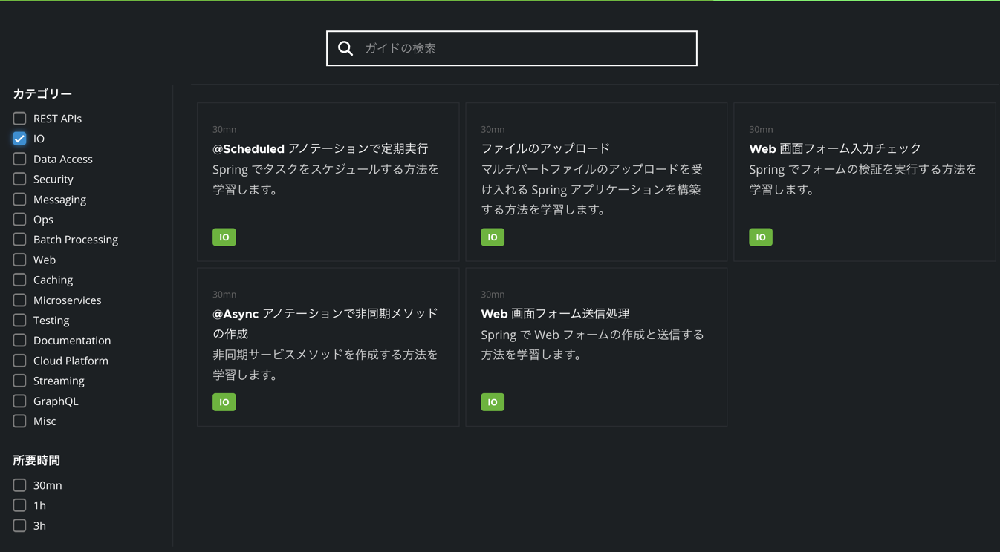
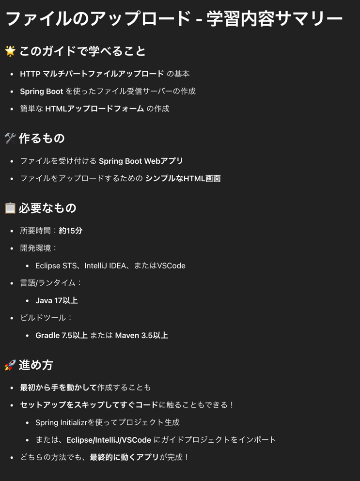
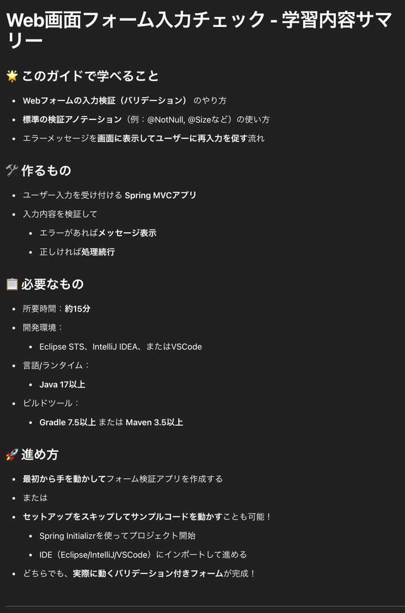
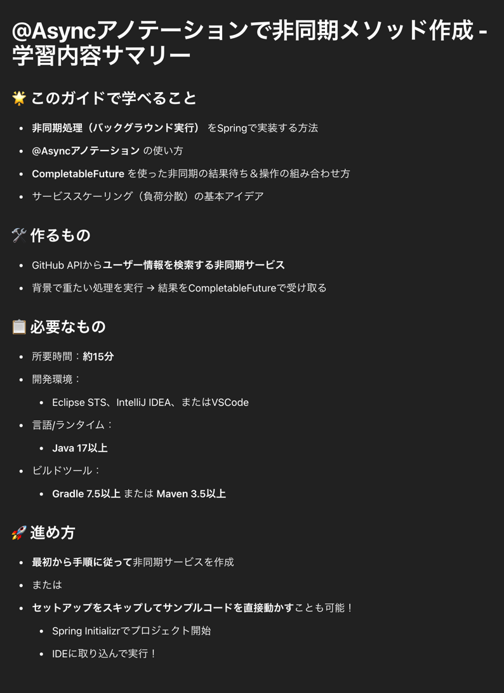
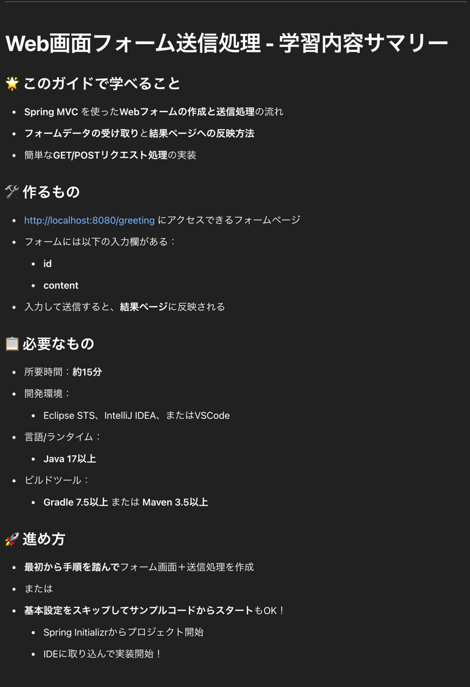

# 転職先で使うかもしれないので入門してみた

## [@Scheduled アノテーションで定期実行](https://spring.pleiades.io/guides/gs/scheduling-tasks)

## [ファイルのアップロード](https://spring.pleiades.io/guides/gs/uploading-files)

## [Web 画面フォーム入力チェック](https://spring.pleiades.io/guides/gs/validating-form-input)

## [@Async アノテーションで非同期メソッドの作成](https://spring.pleiades.io/guides/gs/async-method)

## [Web 画面フォーム送信処理](https://spring.pleiades.io/guides/gs/handling-form-submission)
