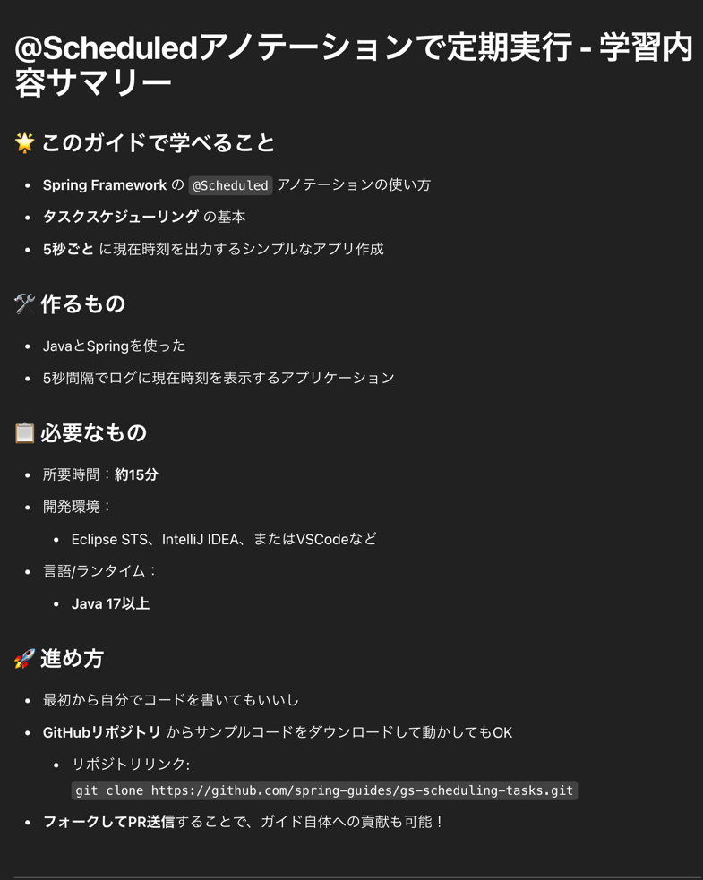
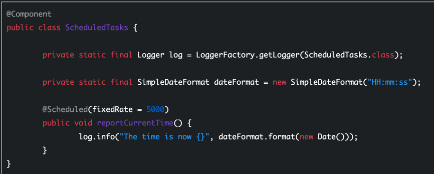
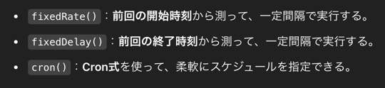
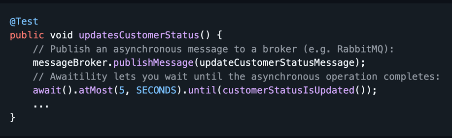
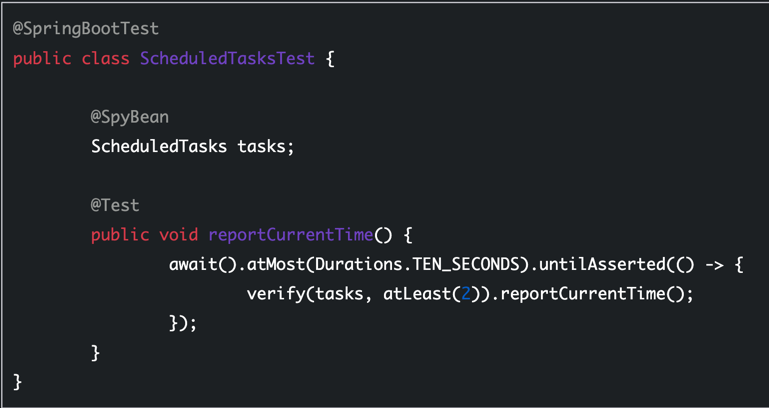

# [@Scheduled アノテーションで定期実行](https://spring.pleiades.io/guides/gs/scheduling-tasks)

### スケジューリングを有効にする
- main クラスにアノテーションつけるいつもの
### スケジュールされらタスクを作成する

- `@Scheduled`: 特定のメソッドがいつ実行されるかを定義

- クーロンはそもそもコマンドでも存在するよね
- こっちでバッチ処理用のプログラムを　python とかで実行するのもやったことあるね
- [crontab コマンド](https://www.ibm.com/docs/ja/aix/7.2?topic=c-crontab-command)
### アプリケーションの実行
- 普通に実行
### awaitility 依存関係を使用したテスト
- [Awaitility](https://github.com/awaitility/awaitility)
  - Awaitilityは、非同期システムのテストを簡単にするためのDSL（ドメイン特化言語）
  - 通常、非同期テストはスレッドやタイムアウト処理でごちゃごちゃしがちだけど、Awaitilityを使うと**「いつまでにこうなってるはず」みたいな期待をシンプルに書ける
  - 例では、RabbitMQにメッセージを送った後、「5秒以内に顧客ステータスが更新されること」を待つコードが紹介されてる
  - 
  - 5秒以内というよりはステータス変更を最大5秒待つってことね、1秒ごとに `customerStatusIsUpdated()` を叩いているイメージ
- 
  - `@SpringBootTest` Spring Bootのテスト用設定をロードして、アプリケーションコンテキスト全体を使った統合テストを実行
  - `@SpyBean` Springが管理するBean（ここでは ScheduledTasks）をスパイするためのアノテーション
    - スパイ、モック、スタブのところか、、ちゃんと理解しないとな
    - スパイは、元のメソッドを呼び出しつつ、呼び出しの回数や引数を検証したりすることができる
    - この場合、tasks という変数がスパイされた ScheduledTasks クラスのインスタンス
  - `await().atMost(Durations.TEN_SECONDS).untilAsserted()`
    - await() は、非同期の処理が完了するまで待機する
    - Durations.TEN_SECONDS は、10秒間待つ
    - `untilAsserted()` は、指定されたアサーションが成功するまで待機します。つまり、指定した条件（アサーション）が成立するまで最大10秒間繰り返しチェックするということ。
    - verify を 1秒ごとに最大10回たたくということだね
  - まとめると、一個上の章で定義した `reportCurrentTime()` が 5秒ごとに呼ばれるはずなので、それを確認しているテストってことね
### アプリケーションの構築
- 定期実行アプリケーションをどういう形で配布するか、というお話
  - JARファイルのビルドと実行
  - Cloud Native Buildpacks を使用した Docker コンテナーの構築と実行
    - これすぐ理解できてないかも
  - ネイティブイメージのサポート
    - 何これって思ったのでさまった
    - What: Javaアプリケーションを通常のJVM（Java仮想マシン）ではなく、ネイティブコード（機械語）にコンパイルすることを指す
    - Why: 起動時間の短縮とメモリ使用量の削減、要するにサクッと起動したい、AWS みたいな従量課金系のインフラ上で動かしたい場合に役立つ
  - Spring Bootでのネイティブイメージのサポート
- まとめ
  - この辺は詳しく知っておく必要はない、その時が来たらさまざまなケースに合わせて定期実行アプリをビルドできるよってことだけ覚えておけば良い