# 転職先で使うかもしれないので入門してみた
- RestApi を作れるやつからお試し
- DB と繋がないと意味ないからそこから続きをやろう
- 一日2つくらいのペースで進めてみる
- 裏ですごい色々とやってくれるみたいで実装自体は全然難しくなさそう

# 大前提 (Geode が出てきた時に色々と混乱したので大前提を把握するための章)
chatGpt に Spring Boot を使う上で前提となる知識を教えてもらった
1. クライアント: リクエスト送信側 (ブラウザ、モバイルアプリ、Spring Boot アプリ)
2. サーバー: リクエスト受信、レスポンス返却側(Web Api, DB, Geode サーバーなど)
   1. Spring Boot でアプリを書いている場合は、そのアプリ自体がクライアントとして他のサーバーに接続する場合がある、とうぜん、サーバー側として動く場合もある
      1. サーバー側になるケース
         1. 自前で Rest API を公開している時(`@RestController`を使う場合など)
         2. Webフロント(HTML/CSS)を返すWebサーバーの場合
         3. WebSocketサーバーなど
      2. クライアントになるケース
         1. 別のWebサーバーやDBに対してリクエストないしクエリを送信する場合だね
3. Geode のサーバーとクライアント構成
   1. Geodeサーバーとは
      1. メモリ上のリージョン(メモリ上のデータ格納領域)を中央集権的に管理するデータノード
      2. データの保存、永続化、レプリケーションなどを担当
   2. Geode クライアントとは
      1. Spring Boot アプリが @ClientCacheApplication で立ち上がると、Geode サーバーに接続する「クライアント」アプリになる
      2. つまりどういう構成？
      3. 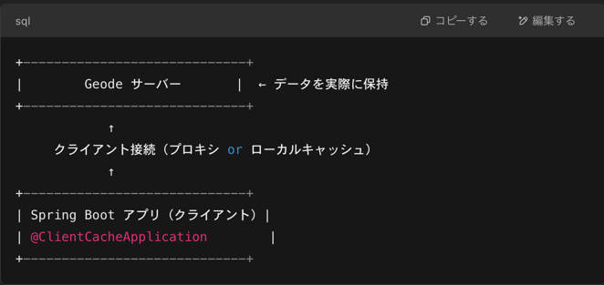
      4.  `ClientRegionShortcut.PROXY`：サーバー側にすべてのデータがあり、クライアントはキャッシュを持たない
      5. `ClientRegionShortcut.LOCAL`: クライアントにだけデータを保持
4. Spring Boot 開発者が知っておくといいサーバー側トピック
   1. 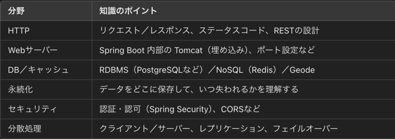
5. 補足: Geodeサーバ０を立ち上げるには？
   1. 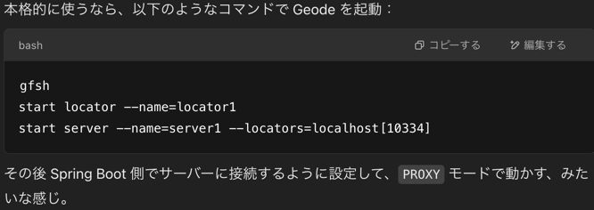

# 大前提その2 Tomcat サーバーについて
1. Tomcat: Spring Boot に内蔵されているWebアプリケーションサーバー(正確にはServletコンテナ)
   1. Httpリクエストを受け取って、Javaサーブレット/JSP を使ってレスポンスを返す
   2. Java EE 仕様の一部: サーブレットAPI, JSP などを提供
2. Spring Boot における Tomcat の使い方(=組み込み)
   1. Spring Boot では Tomcat を組み込みで使うのが標準的
   2. 通常は Tomcat をインストールしてWARファイルをデプロイするが、Tomcat をアプリの一部として組み込み、実行可能JARにパッケージする
3. Spring Boot + Tomcat の構成図
   1. 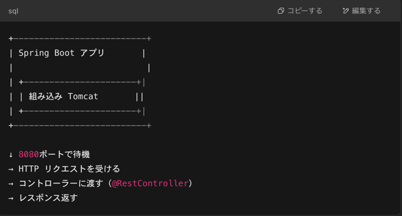
   2. 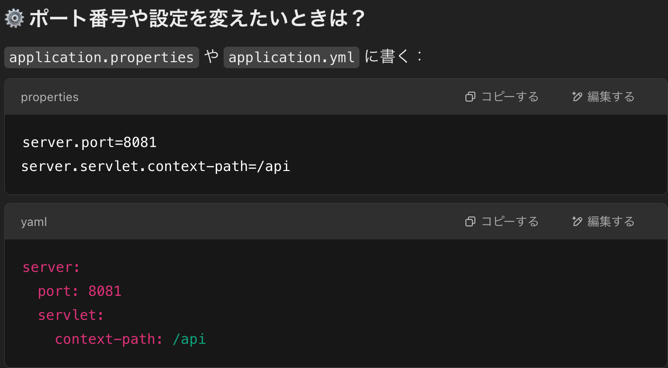
   3. 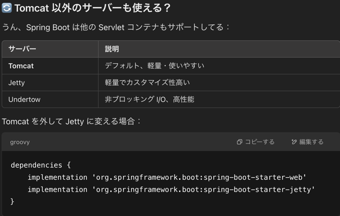
   4. 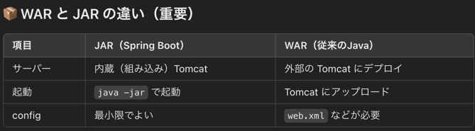
   5. 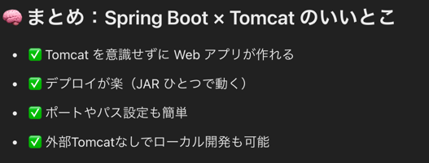

# RestApis
1. [Building a RESTful Web Service
   ](https://spring.pleiades.io/guides/gs/rest-service) ✅
   1. 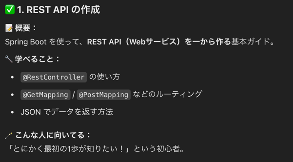
   2. ルーティングとコントローラーとみたいなところを学んだ
   2. URL のクエリパラメータ取る方法とかも学んだ
   3. @SpringBootApplication ちょっとむずい
      1. 3つくらい説明があったけど、すぐ理解できたのは自動 DI をするための仕組みぽいということ
      2. Bean という構成要素を Spring Boot に覚えさせるって説明だったね
2. [RetTemplateでRestAPIの利用](https://spring.pleiades.io/guides/gs/consuming-rest)
   1. 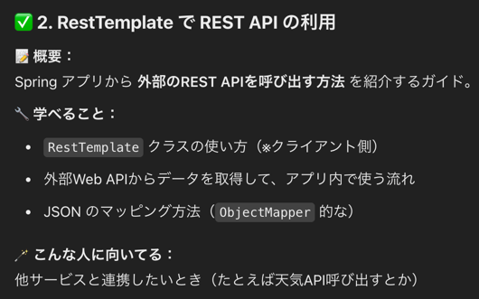
   2. [quoters](https://github.com/spring-guides/quoters) をクローンしてローカル環境で実行する
   3. 作成した Spring Boot アプリケーションをクライアント側、quoters をサーバー側として Rest Api のレスポンス取得をする例
3. [HATEOASでハイパーメディア駆動REST APIの作成](https://spring.pleiades.io/guides/gs/rest-hateoas) ✅
   1. 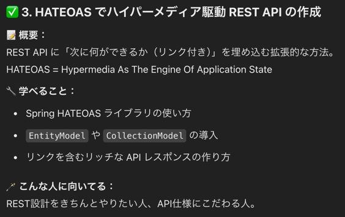
   2. HATEOAS String の使い方の説明
   2. アクセスされたURLから新しいURLを作成して返せまっせって話だった
   3. つまり、HATEOASを使うことで、APIのインターフェースが動的に整備できるというのが重要なポイント(chatgpt)
   4. 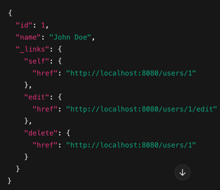
4. [Spring Boot アプリケーションの構築
   ](https://spring.pleiades.io/guides/gs/spring-boot) ✅
   1. 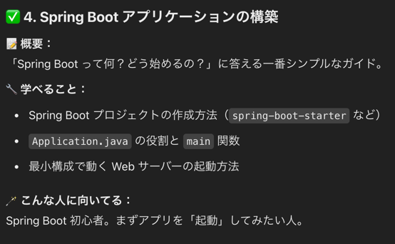
   2. コントローラーに設定したルーティングで適当なページの表示
   3. 及びそのリンクに対する単体テスト、結合テストとか
5. [Spring Data Rest API の自動生成(Neo4j)](https://spring.pleiades.io/guides/gs/accessing-neo4j-data-rest) ✅
   1. 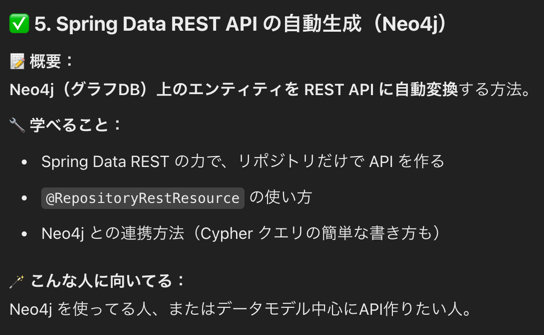
   2. [いきなりグラフデータベース～人生で初めてNeo4jを触ってみた（Cypher入門）
      ](https://recruit.gmo.jp/engineer/jisedai/blog/graph-database-neo4j-try-cypher/)
   3. Neo4j: SNS(linkedin のような)に使われるノードと矢印を用いたデータベース構造をDB
   4. 金融系などでも使われており、これのおかげで不正なデータ間のつながりを検知することができる
   5. この章で扱う Neo4j サーバーは、提供するアプリケーションで Neo4j DB が使われている前提で、このDB を楽に操作するためのライブラリという捉え方で良い
   6. また、3章の HATEOAS と組み合わせることで、例えばSNSアプリにおいては誰と誰がつながっているのか？などを表すハイパーリンクを作成することが用意となる
   7. この章では主にその方法について記述がある
6. [Spring Data Rest API の児童生絵師(Gemfire)](https://spring.pleiades.io/guides/gs/accessing-gemfire-data-rest) ✅
   1. 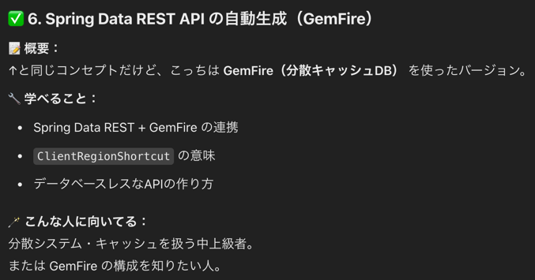
   2. 詳しくは大前提の Geode の構成あたりを参照
   3. そもそも Geodeはサーバー
   4. Person クラスを例に、ローカルキャッシュから永続化までの how が書かれている
7. [HATEOASでREST API の構築](https://spring.pleiades.io/guides/tutorials/rest)
   1. 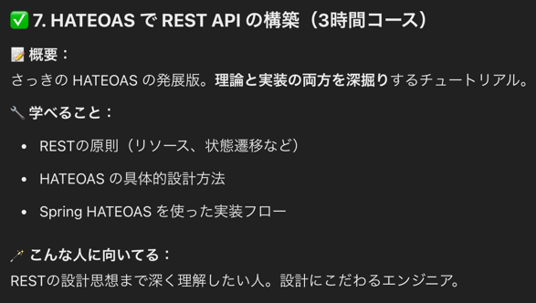
   2. 概要
      1. 会社の従業員を管理する簡単な給与計算サービスの作成、授業インオブジェクトをH2インメモリデータベースに保存し、JPAを介してアクセスする
      2. インターネット経由でアクセスできるようにするもの(Spring MVCレイヤーと呼ばれるもの)でこれをラップする
   3. nonrest/src/main/java/Employee
      1. Employeeエンティティ
         1. @Entity: このオブジェクトを JPAベースのデータストアに保存する準備をするためのJPAアノテーション
         2. id: 主キー
         3. 要するにテーブル作っているだけや
   4. non rest/src/main/java EmployeeRepository
      1. JpaRepository
         1. Employee エンティティを操作するためのインターフェース
         2. CRUD 操作を SQLを書かなくてもメソッド呼ぶだけで実装できる優れもの
         3. 誕生背景としては、ボイラープレートコードを無くそうねという目的から
   5. これだけで動作するので、試しに CommandLineRunner で適当なデータを入れてあげるとH2?データベースにデータが入っていますよと
   6. HTTP がプラットフォーム
      1. リポジトリをWebレイヤーでラップするためにSpring MVC を使う
      2. Spring Boot を使用すると、少しのコードを追加するだけで済む
      3. `@RestController`: 各メソッドによって返されるデータがテンプレートをレンダリングするのではなく、レスポンス本文に直絵sつ書き込まれることを示す
      4. `EmployeeNotFoundException`を定義してスローすると、SPring MVC構成のこの追加情報を使用して HTTP404エラーが発生する
      5. `EmployeeNotFoundAdvice`の各アノテーションで諸々の設定を行う
         1. `@ExceptionHandler`: `EmployeeNotFoundException`がスローされた場合にのみ応答するようにアドバイスを構成
         2. `@ResponseStatus`: `HttpStatus.NOT_FOUND`つまり HTTP 404 エラーを発行するように指示
         3. アドバイスの本文がコンテンツを生成する
         4. この場合、例外のメッセージが表示されます
   7. サービスを RESTful にする要素は何か？
      1. 要するに、ハイパーメディアを使っていない場合は RestFul とは言えないみたいなことが言いたいらしい
      2. つまり、ある状態を示す時にハードコードするんじゃなくて動的に生成できる(ここで言えば Spring HATEOAS)を用いたリンクの自動生成ができること、を必要条件としたいみたい
      3. > (つまり API) がハイパーテキストによって駆動されていない場合、RESTful であることはできず、REST API であることはできません
   8. Spring HATEOAS
      1. ハイパーメディア駆動型出力の作成を支援することを目的とした Spring プロジェクトである Spring HATEOAS を紹介する
      2. サービスを RESTful にアップグレードするには、ビルドに次のコードを追加する
      3. [github](https://github.com/spring-guides/tut-rest/tree/main) の nonrest と rest に違いはこのライブラリをつかているかどうかの違いだね
      4. one メソッドにリンクを追加してるねえ
      5. all メソッドにアクセスすると、それぞれ個別の従業員のリンク付きレスポンスを得ることができるっていうのが味噌なんだな
      6. そのためには、従業員データをラップしてくれる型が必要
      7. 今までは Employeeで返却していたものを　EntityModel でラップし、さらに Collection でラップする
      8. EntityModel<T> 
         1. Spring HATEOAS の汎用コンテナーであり、データだけでなくリンクのコレクションも含まれている
      9. CollectionModel<> は別の Spring HATEOAS コンテナー
         1. これは、前述の EntityModel<> のような単一のリソースエンティティではなく、リソースのコレクションをカプセル化することを目的としている
         2. CollectionModel<> でも、リンクを含めることができる
   9. リンク作成の簡素化
      1. 重複コードをアセンブラーしちゃおうねっていう話だね
      2. また、Spring Framework の @Component アノテーションを適用することで、アプリの起動時にアセンブラーが自動的に作成される
      3. `@Component` にしておくことで自動DIできるんだね
      4. アセンブラを使用して主役ルートリソースを取得する
   10. 進化する REST API (次ここから)
       1. DB というかモデルの構成が変わってもモデルから使わなくなったカラムを消すなって話
   11. REST API へのリンクの構築
       1. これまで、必要最低限のリンクを備えた進化可能な API を構築してきた
       2. API を拡張し、クライアントにさらに優れたサービスを提供するには、アプリケーション状態のエンジンとしてハイパーメディアの概念を取り入れる必要がある
          1. ずっとハイパーメディアの話してるね
       3. それは何を意味するのか?ハンズオン
          1. `Order.java` っていうモデルクラスを作って `Status` っていうオーダーの状態クラス作って、(`Order` API を叩く処理のステータスって命名にした方がいいと思うけど。。画面のステータスもあるんじゃないのかい？と思ったが、payroll パッケージにいるので問題ないか)
          2. `Repository interface` 作ってコントローラー作って、通信処理と`NotFoundException` 作って、DBからの取得処理が書いてあるね
          3. これで一連の MVC の MC が作れたねと
          4. `すべてのコントローラーメソッドは、Spring HATEOAS の RepresentationModel サブクラスの 1 つを返し、ハイパーメディア（またはそのような型のラッパー）を適切にレンダリングします`
          5. うんうん、Rest も守れているじゃんと
          6. `OrderModelAssembler` 
             1. リンク付きのオブジェクト（注文情報＋できる操作リンク）を作るのが OrderModelAssembler の役割。
             2. 背景
                注文（Order）の状態は、「進行中（IN_PROGRESS）」「完了（COMPLETED）」「キャンセル（CANCELLED）」とかがある
             3. 問題点
                状態（Status）を見てクライアント（アプリ側）が「この状態ならこのボタン出そう！」って自分で判断する作りにすると、
                例えば新しい状態を追加したとき（例：「返品中」とか）、クライアントが壊れるリスクが出てくる
                また、国によって表示テキスト（ロケール対応）を変えるとか、状態の名前を変えた場合も、クライアントがうまく動かなくなる可能性がある。
             4. 解決策 → HATEOAS（Hypermedia as the Engine of Application State）を使う
                クライアントが「状態を見て自分で推測する」のをやめさせて、
                サーバー側から「今できる操作」をリンクで教えるようにする。
             5. つまり、「キャンセルできるなら、キャンセルのリンクを送る」、「完了できるなら、完了のリンクを送る」
             6. クライアント側は「リンクがあればボタンを出す」「リンクがなければ出さない」だけをすればいい→ これで、サーバー側だけ直せばよくなる。クライアントは壊れにくくなる！
             7. 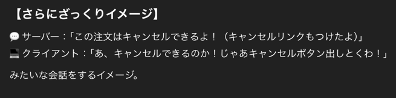
             8. クライアントは当然 API を叩く側ね、API 仕様書とかにこういうのが載ってくるイメージかな
             9. 勝手に状態を追加したので、コントローラーで当然 cancel と complete の URL を捌く処理を書くはずよな
             10. OrderController で「キャンセル」操作を作成する <-- 当然やな
             11. complete は難しくないと思うんだけど、cancel は非同期処理を適切に止めないといけないし、そっちが完了していたら購入処理が通ったことになるからハンドリング複雑そうだな
             12. complete 
                 1. 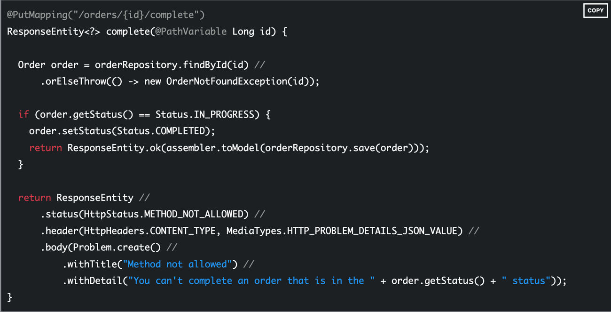
                 2. DB に注文が存在するかどうか確認
                 3. DB に注文があり、かつステータスが「進行中（IN_PROGRESS）」であるかを確認
                 4. ステータスを「完了（COMPLETED）」に変更
                 5. 変更した注文情報をデータベースに保存し、HATEOAS リンクを生成
                 6. assembler.toModel(order) で注文データに関連するリンクを追加
                 7. そして、それを ResponseEntity に入れて HTTP レスポンスとしてクライアントに返す
                 8. ステータスが「進行中（IN_PROGRESS）」以外の場合、完了処理が無効なのでエラーを返している
             13. Repository の具体的なコードが存在しないけど、まあわかるからよしとしよう
   12. 要約
       1. クライアントを壊さないために以下を徹底しよう
          1. 古いフィールドを削除しない
          2. rel ベースのリンクを使用する場合、クライアントは URI をハードコードする必要はない
          3. 古いリンクはできる限り保持、URIを変更する必要がある場合でも、古いクライアントが新しい機能へのパスを持つようにrelを保持
          4. ペイロードデータではリンクを使わずに、さまざまな状態駆動操作が利用可能な場合にクライアントに指示
       2. これで、Spring を使用して RESTful サービスを構築する方法に関するチュートリアルを終了
       3. このチュートリアルの各セクションは、単一の github リポジトリ内の個別のサブプロジェクトとして管理されます。 
          1. nonrest — ハイパーメディアのないシンプルな Spring MVC アプリ 
          2. rest — 各種リソースのHAL表現を備えた Spring MVC + Spring HATEOAS アプリ 
          3. EVOLUTION — フィールドは進化しますが、下位互換性のために古いデータが保持される REST アプリ 
          4. リンク— 有効な状態変更をクライアントに通知するために条件付きリンクが使用される REST アプリ
       4. Spring HATEOAS の使用例をさらに表示するには、https://github.com/spring-projects/spring-hateoas-examples (英語) を参照
       5. さらに詳しくは、Spring チームメイトの Oliver Drotbohm による次のビデオを参照
       6. [REST Beyond the Obvious - API Design for Ever-Evolving Systems](https://www.youtube.com/watch?v=WDBUlu_lYas)

8. [WebFlux REST API と WebClient](https://spring.pleiades.io/guides/gs/reactive-rest-service)